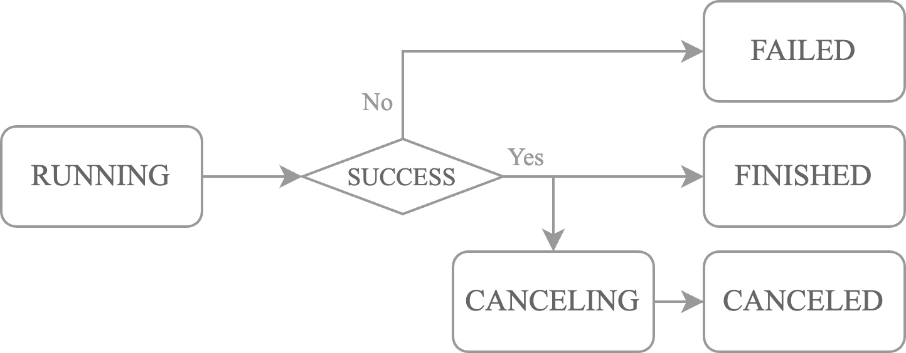
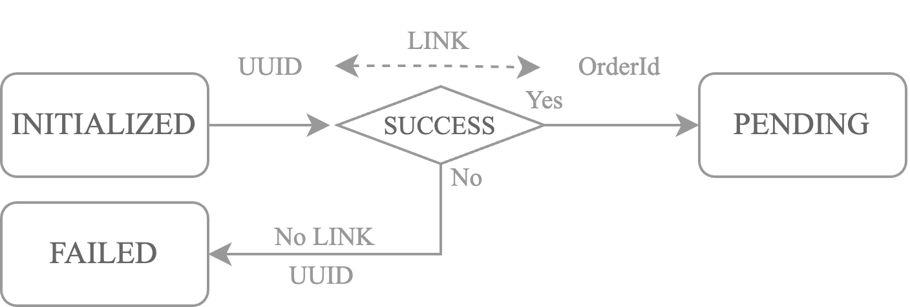
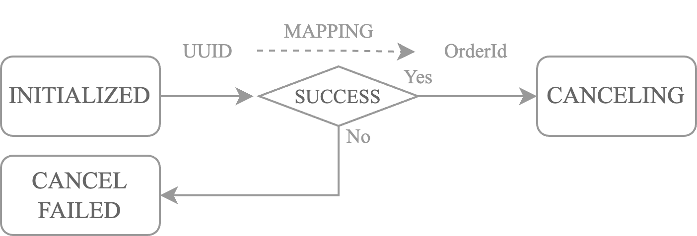

Orders
========

This guide offers detailed information about the various order types available on the platform, as well as the execution instructions supported for each.

Orders are a fundamental component of any algorithmic trading strategy. Tradebot has integrated a wide range of order types and execution instructions, from standard to advanced, to maximize the potential functionality of trading venues. This allows traders to set specific conditions and instructions for order execution and management, enabling the creation of virtually any type of trading strategy.

Overview
-----------

There are two types of orders: ``Basic Order`` and ``Algorithmic Order``. 

- ``Basic Order``
    - ``Limit Order`` 
    - ``Market Order``
- ``Algorithmic Order``
    - ``TWAP``

You can create a ``Basic Order`` by calling the ``create_order`` method in ``Strategy`` class. 

.. code-block:: python

    from tradebot.strategy import Strategy
    from tradebot.constants import ExchangeType, OrderSide, OrderType

    class Demo(Strategy):
        def __init__(self):
            super().__init__()
            self.create_order(
                order_type=OrderType.LIMIT, 
                symbol="BTCUSDT", 
                side=OrderSide.BUY, 
                price=10000,
                amount=1,
            )

You can create an ``Algorithmic Order`` by calling the ``create_twap`` method in ``Strategy`` class.

.. code-block:: python

    self.create_twap(
        symbol=symbol,
        side=OrderSide.BUY if diff > 0 else OrderSide.SELL,
        amount=abs(diff),
        duration=65,
        wait=5,
        account_type=BybitAccountType.UNIFIED_TESTNET, # recommend to specify the account type
    )

Order Status
---------------
.. image:: ../_static/order.png
    :alt: Order Status Flow
    :align: center

The Order Status is defined in ``OrderStatus`` class. We define 4 groups of statuses:

- ``LOCAL``: The order is created by the user and not sent to the exchange yet.
    - ``INITIALIZED``: when order is created by ``create_order`` method or ``cancel_order`` method
    - ``FAILED``: when order is failed to be created
    - ``CANCEL_FAILED``: when order is failed to be canceled
- ``IN-FLOW``: The order is sending to the exchange but the websocket response is not received yet.
    - ``PENDING``: when order is pending on the exchange
    - ``CANCElING``: when order is pending to be canceled
- ``OPEN``: The order is open on the exchange which means the websocket response is received.
    - ``ACCEPTED``: when order is accepted by the exchange
    - ``PARTIALLY_FILLED``: when order is partially filled
- ``CLOSED``: The order is closed on the exchange which means the order is ``FILLED``, ``CANCELLED`` or ``EXPIRED``.
    - ``FILLED``: when order is filled
    - ``CANCELLED``: when order is cancelled (cancelled by the user).
    - ``EXPIRED``: when order is expired (canceled by the exchange).

Algorithmic Order
------------------

The ``AlgoOrder`` is a special type of order that is created by the ``create_twap`` method in ``Strategy`` class. It is used to create a ``TWAP`` order. The status of the ``AlgoOrder`` is defined in ``AlgoOrderStatus`` class. The ``TWAP`` order is used to execute a large order in a series of smaller orders over a specified period of time. There are 5 statuses:

- ``RUNNING``: when the ``TWAP`` order is running
- ``CANCELING``: when the ``TWAP`` order is canceling
- ``CANCELLED``: when the ``TWAP`` order is cancelled
- ``FINISHED``: when the ``TWAP`` order is finished
- ``FAILED``: when the ``TWAP`` order is failed to be created, or one of the orders in the ``TWAP`` order is failed to be created.

Order Linkage
--------------

Order Creation
~~~~~~~~~~~~~~~

Tradebot uses an internal order and exchange order linkage mechanism. When an internal order is created, i.e., the status is ``INITIALIZED``, a ``UUID`` is automatically created. When it is submitted to the exchange, if successful, it will be linked to the ``ORDER_ID`` returned by the exchange. If it fails, it will not be linked, and the ``UUID`` will be set to ``FAILED``.

Order Cancellation
~~~~~~~~~~~~~~~~~~

When an order is canceled, user need to specify the ``UUID`` of the order to be canceled by calling the ``cancel_order`` method in ``Strategy`` class. The ``UUID`` will be mapped to the ``ORDER_ID`` and submitted to the exchange for cancellation.

