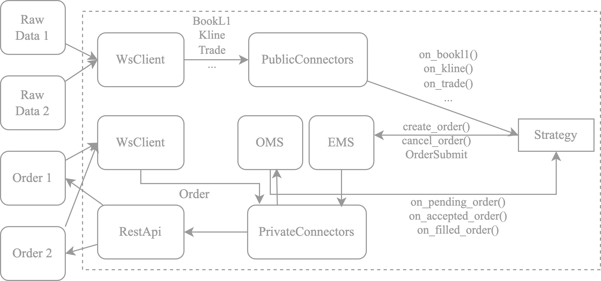

Welcome to NexusTrader's documentation!
=========================================
.. |python-versions| image:: https://img.shields.io/badge/python-3.10%20%7C%203.11%20%7C%203.12-blue?logo=python
   :alt: Python Versions

.. |docs| image:: https://img.shields.io/badge/docs-passing-brightgreen
   :alt: Documentation Status

|python-versions| |docs| 

Introduction
-----------------

NexusTrader is a professional-grade open-source quantitative trading platform, specifically designed for **large capital
management** and **complex strategy development**, dedicated to providing high-performance, scalable, and user-friendly
quantitative trading solutions.

Core Advantages
-----------------

- 🚀 **Professionally Optimized Order Algorithms**: Deep optimization for algorithmic orders including TWAP, effectively reducing market impact costs. Users can easily integrate their own execution signals to achieve more efficient and precise order execution.
- 💰 **Professional Arbitrage Strategy Support**: Provides professional optimization for various arbitrage strategies, including funding rate arbitrage and cross-exchange arbitrage, supporting real-time tracking and trading of thousandsof trading pairs to help users easily capture arbitrage opportunities.
- 🚧 **Full-Featured Quantitative Trading Framework**: Users don't need to build frameworks or handle complex exchange interface details themselves. NexusTrader has integrated professional position management, order management, fundmanagement, and statistical analysis modules, allowing users to focus on writing strategy logic and quickly implement quantitative trading.
- 🚀 **Multi-Market Support and High Scalability**: Supports large-scale multi-market tracking and high-frequency strategy execution, covering a wide range of trading instruments, making it an ideal choice for professional trading needs.

Why NexusTrader Is More Efficient?
------------------------------------

- **Enhanced Event Loop Performance**:
  NexusTrader leverages `uvloop <https://github.com/MagicStack/uvloop>`_, a high-performance event loop, delivering speeds up to 2-4 times faster than Python's default asyncio loop.
- **High-Performance WebSocket Framework**:
  Built with `picows <https://github.com/tarasko/picows>`_, a Cython-based WebSocket library that matches the speed of C++'s Boost.Beast, significantly outperforming Python alternatives like websockets and aiohttp.
- **Optimized Data Serialization**:
  Utilizing `msgspec` for serialization and deserialization, NexusTrader achieves unmatched efficiency, surpassing tools like ``orjson``, ``ujson``, and ``json``. All data classes are implemented with ``msgspec.Struct`` for maximum performance.
- **Scalable Order Management**:
  Orders are handled efficiently using ``asyncio.Queue``, ensuring seamless processing even at high volumes.
- **Rust-Powered Core Components**:
  Core modules such as the MessageBus and Clock are implemented in Rust, combining Rust's speed and reliability with Python's flexibility through the `nautilius <https://github.com/nautilius/nautilius>`_ framework.

Architecture(Data Flow)
----------------------------

The core of Tradebot is the ``Connector``, which is responsible for connecting to the exchange and data flow. Through the ``PublicConnector``, users can access market data from the exchange, and through the ``PrivateConnector``, users can execute trades and receive callbacks for trade data. Orders are submitted through the ``OrderExecutionSystem``, which is responsible for submitting orders to the exchange and obtaining the order ID from the exchange. Order status management is handled by the ``OrderManagementSystem``, which is responsible for managing the status of orders and sending them to the ``Strategy``.

Key Features
--------------

- 🌍 **Multi-Exchange Integration**: Effortlessly connect to top exchanges like Binance, Bybit, and OKX, with an extensible design to support additional platforms.
- ⚡ **Asynchronous Operations**: Built on asyncio for highly efficient, scalable performance, even during high-frequency trading.
- 📡 **Real-Time Data Streaming**: Reliable WebSocket support for live market data, order book updates, and trade execution notifications.
- 📊 **Advanced Order Management**: Execute diverse order types (limit, market, stop) with optimized, professional-grade order handling.
- 📋 **Account Monitoring**: Real-time tracking of balances, positions, and PnL across multiple exchanges with integrated monitoring tools.
- 🛠️ **Modular Architecture**: Flexible framework to add exchanges, instruments, or custom strategies with ease.
- 🔄 **Strategy Execution & Backtesting**: Seamlessly transition from strategy testing to live trading with built-in tools.
- 📈 **Scalability**: Designed to handle large-scale, multi-market operations for retail and institutional traders alike.
- 💰 **Risk & Fund Management**: Optimize capital allocation and control risk exposure with integrated management tools.
- 🔔 **Instant Notifications**: Stay updated with alerts for trades, market changes, and custom conditions.

Contact
-------

.. |twitter| image:: https://img.shields.io/badge/X-000000?&logo=x&logoColor=white
   :target: https://x.com/quantweb3_ai

.. |discord| image:: https://img.shields.io/badge/Discord-5865F2?&logo=discord&logoColor=white
   :target: https://discord.gg/BR8VGRrXFr

.. |telegram| image:: https://img.shields.io/badge/Telegram-2CA5E0?&logo=telegram&logoColor=white
   :target: https://t.me/+6e2MtXxoibM2Yzlk

|twitter| Stay updated with our latest news, features, and announcements.

|discord| Join our community to discuss ideas, get support, and connect with other users.

|telegram| Receive instant updates and engage in real-time discussions.

Contents
----------

.. toctree::
   :maxdepth: 2

   installation
   quickstart/index
   concepts/index
   exchange/index
   api/index
